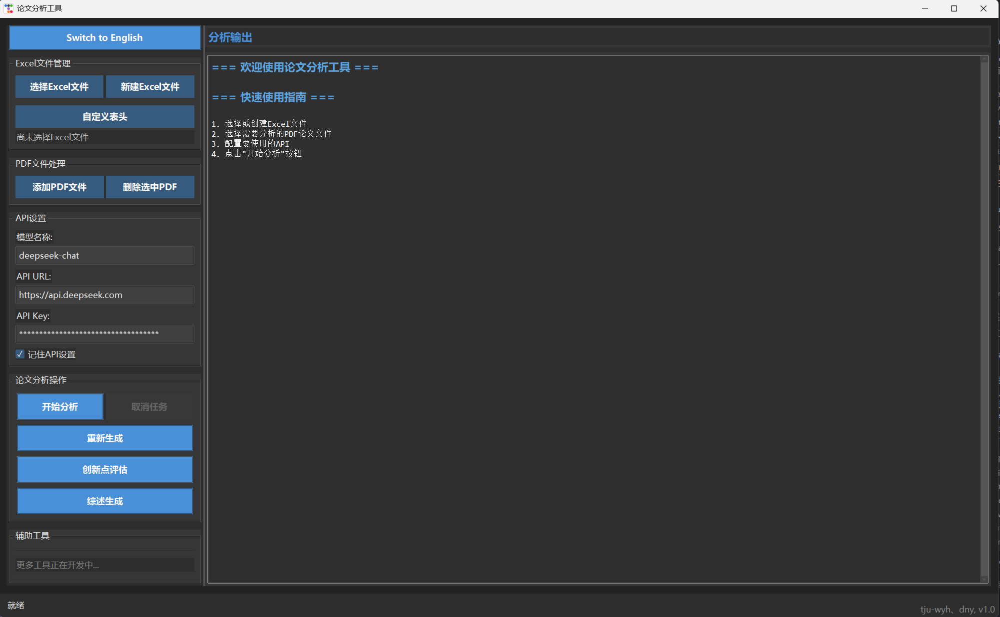
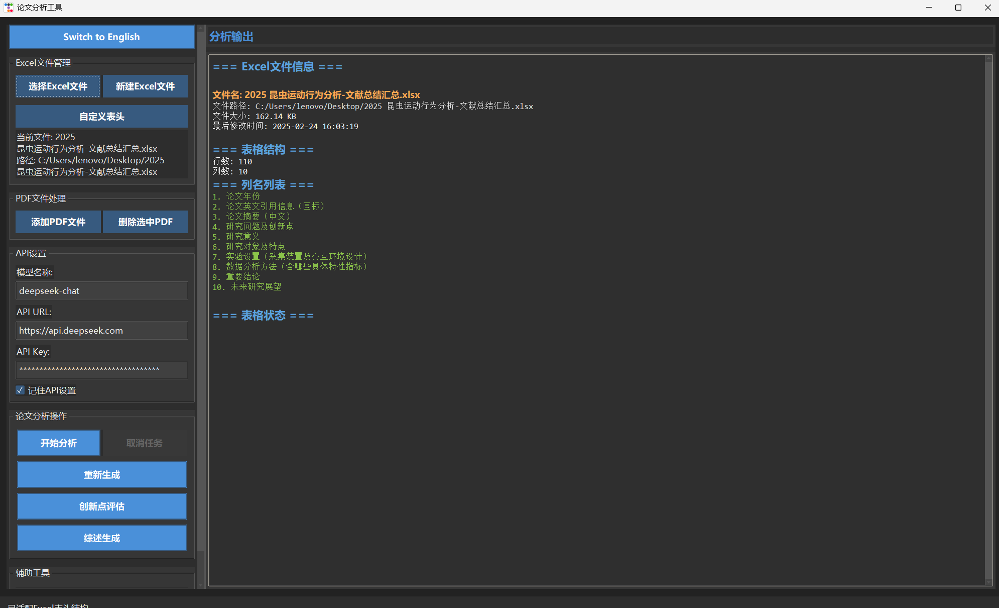
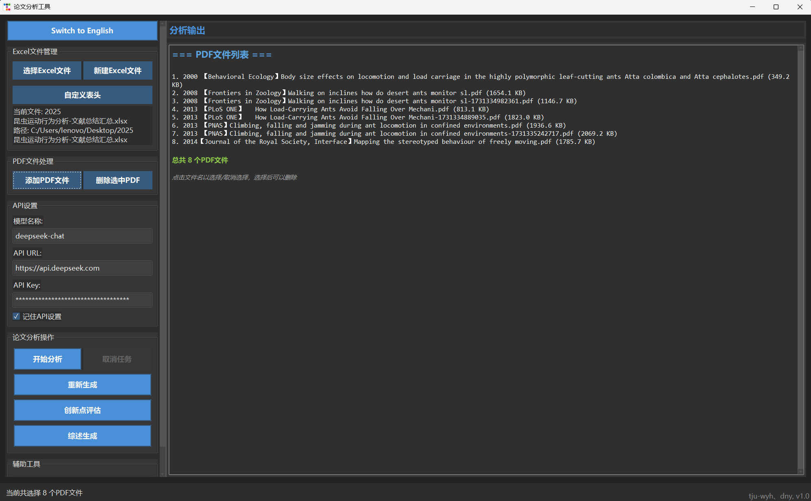
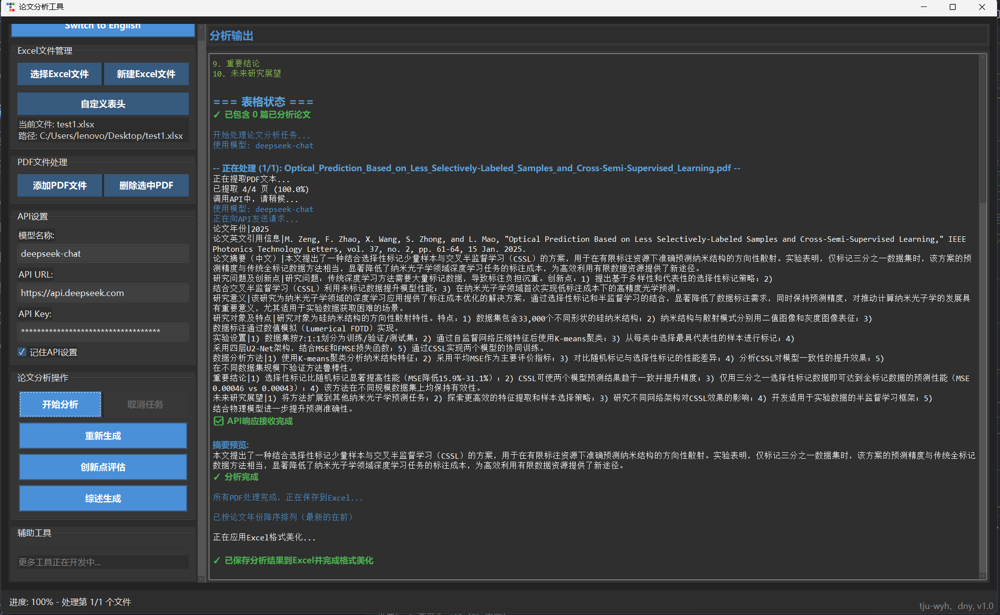
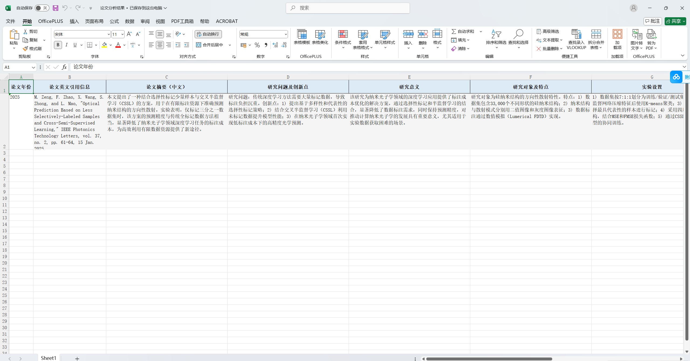
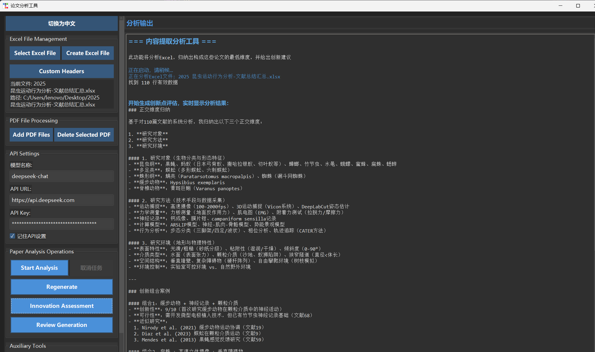
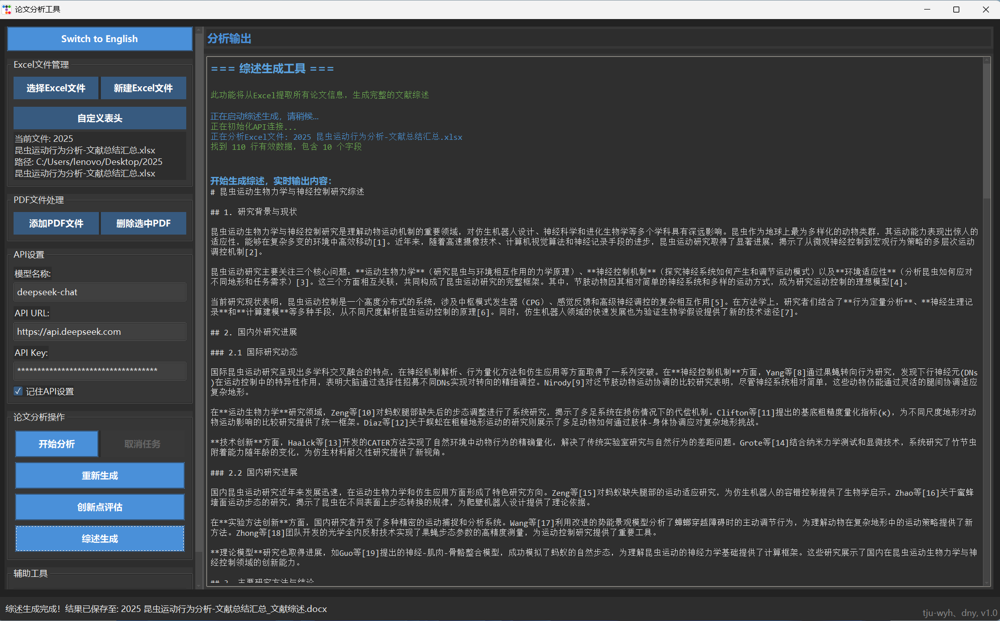
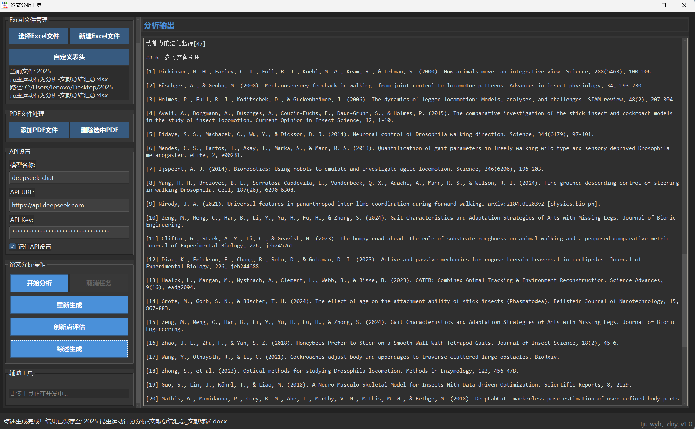

# 论文分析工具 (Paper Analysis Tool)

一个功能强大的学术论文分析工具，可以帮助研究者从论文中提取关键信息、生成文献综述、分析创新点，提高学术研究效率。



## 目录

- [安装说明](#安装说明)
- [功能概述](#功能概述)
- [目录结构](#目录结构)
- [详细使用指南](#详细使用指南)
  - [Excel文件管理](#excel文件管理)
  - [PDF文件处理](#pdf文件处理)
  - [API设置](#api设置)
  - [论文分析](#论文分析)
  - [创新点提取](#创新点提取)
  - [文献综述生成](#文献综述生成)
- [常见问题](#常见问题)
- [联系与支持](#联系与支持)

## 安装说明

### 系统要求
- Windows 10/11 或 macOS 10.14+
- Python 3.8+ (如果从源码运行)

### 安装方法

#### 方法1：直接运行可执行文件
1. 从[发布页面]下载最新版本的安装包
2. 解压缩后运行`论文分析工具.exe`

#### 方法2：从源码运行
```bash
# 克隆代码库
git clone 

# 安装依赖
pip install -r requirements.txt

# 运行程序
python main.py
```

## 功能概述

论文分析工具提供以下核心功能：

- **论文分析**：从PDF文件中提取论文关键信息并保存到Excel
- **创新点提取**：从Excel中提取的信息归纳研究维度，生成创新点评估报告
- **文献综述生成**：自动生成完整的文献综述，包含背景、方法、结论等章节
- **自定义表头管理**：灵活配置需要提取的信息字段
- **多语言支持**：支持中英文界面切换

## 目录结构

```
pat/
├── configs/          # 配置文件
├── gui/            # GUI界面代码
├── strategies/     # 处理策略实现
├── utils/          # 工具函数
├── example/          # 示例
└── main.py         # 程序入口
```

## 详细使用指南

### Excel文件管理

Excel文件是核心存储分析结果的地方，提供了创建、选择和管理Excel的功能。




#### 按钮功能
- **选择Excel文件**：打开文件选择对话框，选择已有的Excel文件
- **新建Excel文件**：创建一个新的Excel文件，包含默认表头
- **自定义表头**：打开表头编辑器，自定义需要分析的字段

#### 操作步骤
1. 点击"选择Excel文件"或"新建Excel文件"
2. 如需自定义表头，点击"自定义表头"按钮
3. 在表头编辑器中添加、删除或重新排序表头字段
4. 确认后，系统会显示当前Excel文件的基本信息

### PDF文件处理

用于管理需要分析的PDF论文文件。



#### 按钮功能
- **选择PDF文件**：选择多个PDF文件进行批量分析
- **添加PDF文件**：向当前列表添加更多PDF文件
- **删除选中PDF**：删除列表中已选中的PDF文件

#### 操作步骤
1. 点击"选择PDF文件"按钮，在文件选择器中选择一个或多个PDF文件
2. 所选文件会显示在主界面的文件列表中
3. 要添加更多文件，点击"添加PDF文件"
4. 要删除文件，先点击文件列表中的文件名选中，然后点击"删除选中PDF"

### API设置

配置AI模型API连接信息，用于实现论文分析功能。

#### 按钮与输入字段
- **API URL**：输入API服务地址，例如"https://api.openai.com"
- **API Key**：输入您的API密钥
- **模型名称**：选择或输入要使用的模型，如"gpt-3.5-turbo"
- **记住API设置**：勾选此项以保存设置

#### 支持的API
- OpenAI API (GPT-3.5/GPT-4)
- Azure OpenAI服务
- Deepseek API
- 任何兼容OpenAI API格式的第三方API

#### 操作步骤
1. 填写API URL和API Key
2. 选择或输入合适的模型名称
3. 如需保存设置，请勾选"记住API设置"

### 论文分析

从PDF文件中提取关键信息并保存到Excel中。





#### 按钮功能
- **开始分析**：开始批量分析选定的PDF文件
- **重新生成**：重新分析已选PDF而不清空已有数据
- **取消任务**：取消正在进行的分析任务

#### 分析流程
1. 确保已选择Excel文件和PDF文件，并配置好API
2. 点击"开始分析"按钮启动分析
3. 系统会从每个PDF提取文本，发送到API进行分析
4. 分析结果会实时显示在输出区域
5. 分析完成后，结果会自动保存到Excel文件中

### 创新点提取

从Excel中的论文信息归纳研究维度，分析创新组合可能性。



#### 按钮功能
- **创新点评估**：启动创新点提取和分析
- **取消任务**：取消创新点分析过程

#### 功能描述
创新点评估将分析Excel中的论文数据，自动识别研究领域中的关键维度（如研究对象、研究方法、研究环境等），并分析这些维度的组合可能性，为研究者提供新的研究方向建议。

#### 操作步骤
1. 确保Excel中已有论文分析数据
2. 点击"创新点评估"按钮
3. 系统会自动分析并生成创新点评估报告
4. 结果会保存为Word文档，包含维度分析和创新组合建议

### 文献综述生成

自动生成完整的文献综述，涵盖研究背景、方法、结论等内容。




#### 按钮功能
- **综述生成**：启动文献综述生成过程
- **取消任务**：取消正在进行的综述生成任务

#### 功能描述
文献综述生成功能可以基于Excel中的论文数据自动生成一篇完整的文献综述，包括研究背景、国内外研究进展、主要研究方法与结论、研究空白与争议焦点、未来研究方向与展望，以及规范的参考文献引用。

#### 操作步骤
1. 确保Excel中已有足够的论文分析数据
2. 点击"综述生成"按钮
3. 系统会自动构建并生成综述内容
4. 生成的文献综述会保存为Word文档，包含完整的章节和引用

## 常见问题

### 分析过程中可能出现的问题
- **API连接错误**：检查API URL和Key是否正确，网络是否正常
- **PDF提取失败**：确保PDF文件不是扫描版，可以提取文本
- **分析结果不完整**：可能是由于API上下文限制，尝试使用功能更强的模型

### 速度和性能
- 分析速度主要受API响应速度影响
- 为提高效率，建议批处理适量的PDF文件（10-20个）

### 数据安全
- 所有数据处理在本地完成，仅API请求内容会发送到服务器
- API密钥使用加密存储在本地配置文件中

## 联系与支持

如有问题或建议，请通过以下方式联系我们：
- 发送邮件至：1914457309@qq.com
- 提交问题至：

---


